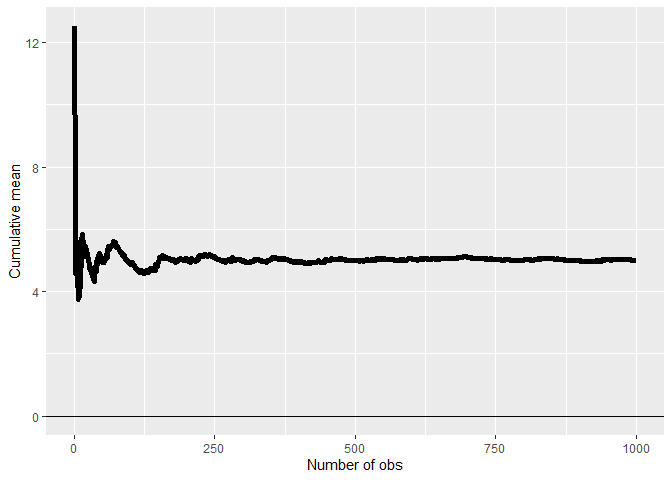
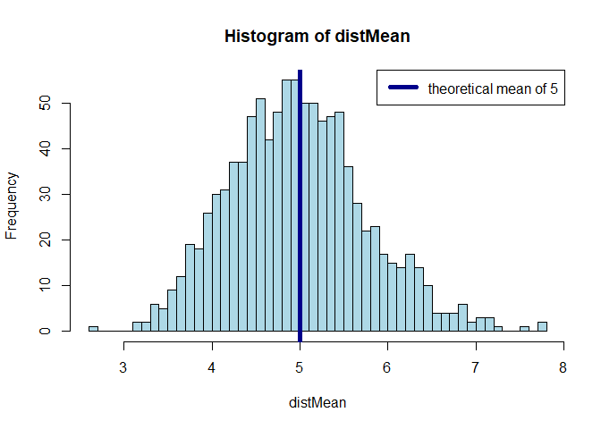
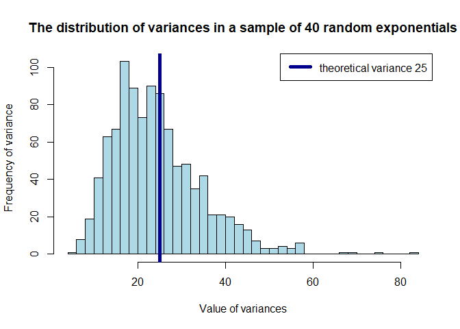
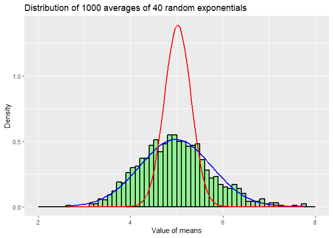

# Part 1

## Overview

In this project you will investigate the exponential distribution in R and compare it with the Central Limit Theorem. The exponential distribution can be simulated in R with rexp(n, lambda) where lambda is the rate parameter. The mean of exponential distribution is 1/lambda and the standard deviation is also 1/lambda. Set lambda = 0.2 for all of the simulations. You will investigate the distribution of averages of 40 exponentials. Note that you will need to do a thousand simulations.

## Simulations


```r
mns = NULL
lambda <- 0.2
nexp <- 40
nsim <- 1000
```

```r
pop_mns <- cumsum(rexp(n = nsim,rate = lambda))/(1:nsim)
mean_pop <- mean(pop_mns)
sd_pop <- sd(pop_mns)

g <- ggplot(data.frame(x = 1:nsim, y = pop_mns), aes(x = x, y = y))
g <- g + geom_hline(yintercept = 0) + geom_line(linewidth = 2)
g <- g + labs(x = "Number of obs", y = "Cumulative mean")
g
```

<!-- -->

### Sample Mean versus Theoretical Mean: 

LLN says that the average limits to what its estimating the population mean, as such that increasing the amount of observations the mean approaches the population mean, in this example being 5.0192226.


```r
mns <- matrix(rexp(1000*40, lambda), nrow = 1000, ncol = 40)
distMean <- apply(mns, 1, mean)
mean_samp <- mean(distMean)
sd_samp <- sd(distMean)

hist(distMean,breaks=50,col='lightblue')
abline(v = 1/lambda, lty = 1, lwd = 5, col = "darkblue")
legend("topright", lty = 1, lwd = 5, col = "darkblue", legend = paste0("theoretical mean of ",round(mean_samp,0)))
```

<!-- -->

The CLT states that the distribution of averages of iid random variables becomes that of a standard normal as the sample size increases. It's average also estimates population average, in this example being 4.9723191

### Sample variability (via variance) in comparison to the theoretical variance of the distribution


```r
distVar <- apply(mns,1,var)
hist(distVar, breaks = 50, main = "The distribution of variances in a sample of 40 random exponentials", xlab = "Value of variances", ylab = "Frequency of variance", col = "lightblue")
abline(v = (1/lambda)^2, lty = 1, lwd = 5, col = "darkblue")
legend("topright", lty = 1, lwd = 5, col = "darkblue", legend = paste0("theoretical variance ",(1/lambda)^2))
```

<!-- -->

Population has smaller variance than the sample, which makes sense since there is a smaller pool of observations in the sample compared to population. Population variance is 0.2873657 while sample variance is 0.7737063. Distribution of variances do not follow the CLT, meaning they are not normal distributions.

### Sample distribution is approximately normal


```r
g <- ggplot(data = data.frame(x = distMean), aes(x = x)) +
        geom_histogram(aes(y =after_stat(density)), color="black", fill="lightgreen",breaks = seq(2, 8, by = 0.1), linewidth = .75) +
        stat_function(fun = dnorm, args = list(mean = mean_samp, sd = sd_samp), color='blue',linewidth=1) +
        stat_function(fun = dnorm, args = list(mean = mean_pop, sd = sd_pop), color='red',linewidth=1) +
        scale_x_continuous("Value of means") +   
        scale_y_continuous("Density") +  
        ggtitle("Distribution of 1000 averages of 40 random exponentials")
g
```

<!-- -->

We can see the distribution becomes normal (blue line) as the means were taken from each group, aligning to the central limit theorem. Comparing the blue line (sample averages distribution normal) to the red line (normal population distribution), we see the distribution of the sample means is close to a normal distribution with the same mean and standard deviation.
