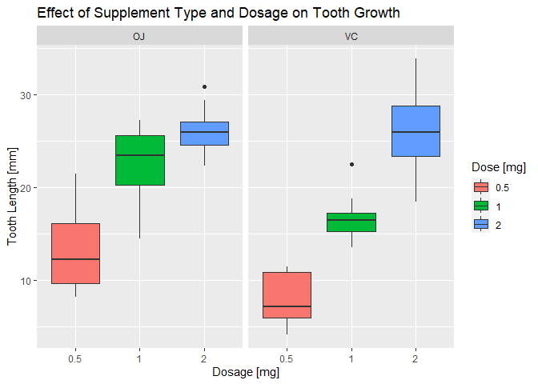

# Part 2

## Overview

Now in the second portion of the project, we're going to analyze the ToothGrowth data in the R datasets package.

## Exploratory data analyses


```r
library(datasets)
data(ToothGrowth)
dim(ToothGrowth)
```

```
## [1] 60  3
```

```r
head(ToothGrowth)
```

```
##    len supp dose
## 1  4.2   VC  0.5
## 2 11.5   VC  0.5
## 3  7.3   VC  0.5
## 4  5.8   VC  0.5
## 5  6.4   VC  0.5
## 6 10.0   VC  0.5
```


```r
summary(ToothGrowth)
```

```
##       len        supp         dose      
##  Min.   : 4.20   OJ:30   Min.   :0.500  
##  1st Qu.:13.07   VC:30   1st Qu.:0.500  
##  Median :19.25           Median :1.000  
##  Mean   :18.81           Mean   :1.167  
##  3rd Qu.:25.27           3rd Qu.:2.000  
##  Max.   :33.90           Max.   :2.000
```
## Summary of the data

The ToothGrowth contains data from a trial with regards to tooth growth response. The response is the length (in mm) of odontoblasts (teeth) in each of 10 guinea pigs at each of three dose levels of Vitamin C (0.5, 1, and 2 mg) with each of two delivery methods (orange juice or ascorbic acid).

Source: C. I. Bliss (1952) The Statistics of Bioassay. Academic Press.

References: McNeil, D. R. (1977) Interactive Data Analysis. New York: Wiley.

Data format:

A data frame with 60 observations on 3 variables.

* [,1] len (numeric) Tooth length in milimeters

* [,2] supp (factor) Supplement type (VC or OJ).

* [,3] dose (numeric) Dose in milligrams.

## A comparison of tooth growth by supp and dose


```r
ggplot(ToothGrowth,aes(x=factor(dose),y=len,fill=factor(dose))) + 
    geom_boxplot() +
    facet_grid(.~supp) +
    scale_x_discrete("Dosage [mg]") +   
    scale_y_continuous("Tooth Length [mm]") +  
    scale_fill_discrete(name="Dose [mg]") + 
    ggtitle("Effect of Supplement Type and Dosage on Tooth Growth")
```

<!-- -->

Through inspection of the plot, a case could be made for OJ giving additional benefit over VC for dosages up to 2mg, additionally it appears that increasing dosage has an positive impact on growth. In the following sections we will test these hypothesis.

### Impact on dosage for OJ


```r
oj_data <- subset(ToothGrowth, supp=='OJ' & dose %in% c(0.5,2))
t.test(len ~ dose,paired=FALSE,var.equal=TRUE,data=oj_data)
```

```
## 
## 	Two Sample t-test
## 
## data:  len by dose
## t = -7.817, df = 18, p-value = 0.0000003402
## alternative hypothesis: true difference in means between group 0.5 and group 2 is not equal to 0
## 95 percent confidence interval:
##  -16.278223  -9.381777
## sample estimates:
## mean in group 0.5   mean in group 2 
##             13.23             26.06
```

T-testing informs that increasing dosage for OJ does in fact increase tooth growth

### Impact on dosage for VC


```r
vc_data <- subset(ToothGrowth, supp=='VC' & dose %in% c(0.5,2))
t.test(len ~ dose,paired=FALSE,var.equal=TRUE,data=vc_data)
```

```
## 
## 	Two Sample t-test
## 
## data:  len by dose
## t = -10.388, df = 18, p-value = 0.000000004957
## alternative hypothesis: true difference in means between group 0.5 and group 2 is not equal to 0
## 95 percent confidence interval:
##  -21.83284 -14.48716
## sample estimates:
## mean in group 0.5   mean in group 2 
##              7.98             26.14
```

T-testing informs that increasing dosage for VC does in fact increase tooth growth

### Comparison between OJ and VC for each dosage amount


```r
dose_vect <- c(0.5,1,2)
doses <- lapply(dose_vect,function(d) {
        dose_data <- subset(ToothGrowth, supp %in% c('VC','OJ') & dose %in% d)
        t.test(len ~ supp,paired=FALSE,var.equal=TRUE,data=dose_data)
})
```

```r
print(doses[1])
```

```
## [[1]]
## 
## 	Two Sample t-test
## 
## data:  len by supp
## t = 3.1697, df = 18, p-value = 0.005304
## alternative hypothesis: true difference in means between group OJ and group VC is not equal to 0
## 95 percent confidence interval:
##  1.770262 8.729738
## sample estimates:
## mean in group OJ mean in group VC 
##            13.23             7.98
```

For dosage amount of 0.5 [mg] there is evidence that the mean growth difference is not 0, meaning there is increased advantage of applying OJ over VC


```r
print(doses[2])
```

```
## [[1]]
## 
## 	Two Sample t-test
## 
## data:  len by supp
## t = 4.0328, df = 18, p-value = 0.0007807
## alternative hypothesis: true difference in means between group OJ and group VC is not equal to 0
## 95 percent confidence interval:
##  2.840692 9.019308
## sample estimates:
## mean in group OJ mean in group VC 
##            22.70            16.77
```

For dosage amount of 1 [mg] there is evidence that the mean growth difference is not 0, meaning there is increased advantage of applying OJ over VC


```r
print(doses[3])
```

```
## [[1]]
## 
## 	Two Sample t-test
## 
## data:  len by supp
## t = -0.046136, df = 18, p-value = 0.9637
## alternative hypothesis: true difference in means between group OJ and group VC is not equal to 0
## 95 percent confidence interval:
##  -3.722999  3.562999
## sample estimates:
## mean in group OJ mean in group VC 
##            26.06            26.14
```

For dosage amount of 2 [mg] there is no evidence that the mean growth difference is not 0, meaning there is no advantage of applying OJ over VC and vice-versa.
