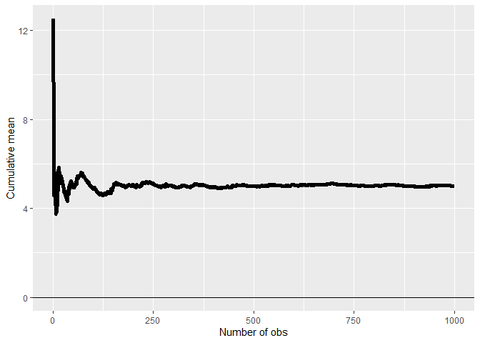
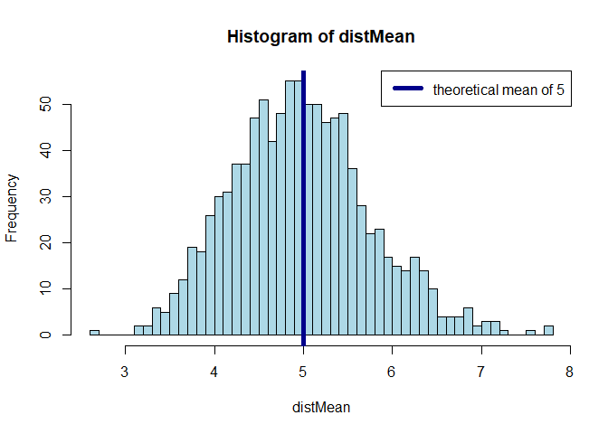
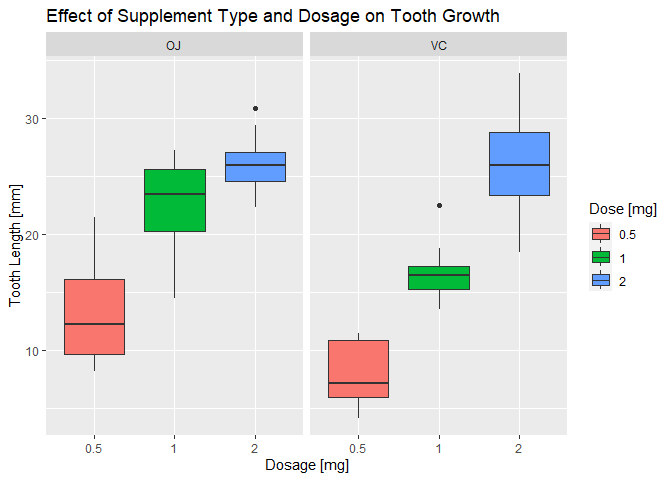

# Part 1

## Overview

In this project you will investigate the exponential distribution in R and compare it with the Central Limit Theorem. The exponential distribution can be simulated in R with rexp(n, lambda) where lambda is the rate parameter. The mean of exponential distribution is 1/lambda and the standard deviation is also 1/lambda. Set lambda = 0.2 for all of the simulations. You will investigate the distribution of averages of 40 exponentials. Note that you will need to do a thousand simulations.

## Simulations


```r
mns = NULL
lambda <- 0.2
nexp <- 40
nsim <- 1000
```

```r
pop_mns <- cumsum(rexp(n = nsim,rate = lambda))/(1:nsim)
mean_pop <- mean(pop_mns)
sd_pop <- sd(pop_mns)

g <- ggplot(data.frame(x = 1:nsim, y = pop_mns), aes(x = x, y = y))
g <- g + geom_hline(yintercept = 0) + geom_line(linewidth = 2)
g <- g + labs(x = "Number of obs", y = "Cumulative mean")
g
```

<!-- -->

### Sample Mean versus Theoretical Mean: 

LLN says that the average limits to what its estimating the population mean, as such that increasing the amount of observations the mean approaches the population mean, in this example being 5.0192226.


```r
mns <- matrix(rexp(1000*40, lambda), nrow = 1000, ncol = 40)
distMean <- apply(mns, 1, mean)
mean_samp <- mean(distMean)
sd_samp <- sd(distMean)

hist(distMean,breaks=50,col='lightblue')
abline(v = 1/lambda, lty = 1, lwd = 5, col = "darkblue")
legend("topright", lty = 1, lwd = 5, col = "darkblue", legend = paste0("theoretical mean of ",round(mean_samp,0)))
```

<!-- -->

The CLT states that the distribution of averages of iid random variables becomes that of a standard normal as the sample size increases. It's average also estimates population average, in this example being 4.9723191

### Sample variability (via variance) in comparison to the theoretical variance of the distribution


```r
distVar <- apply(mns,1,var)
hist(distVar, breaks = 50, main = "The distribution of variances in a sample of 40 random exponentials", xlab = "Value of variances", ylab = "Frequency of variance", col = "lightblue")
abline(v = (1/lambda)^2, lty = 1, lwd = 5, col = "darkblue")
legend("topright", lty = 1, lwd = 5, col = "darkblue", legend = paste0("theoretical variance ",(1/lambda)^2))
```

<!-- -->

Population has smaller variance than the sample, which makes sense since there is a smaller pool of observations in the sample compared to population. Population variance is 0.2873657 while sample variance is 0.7737063. Distribution of variances do not follow the CLT, meaning they are not normal distributions.

### Sample distribution is approximately normal


```r
g <- ggplot(data = data.frame(x = distMean), aes(x = x)) +
        geom_histogram(aes(y =after_stat(density)), color="black", fill="lightgreen",breaks = seq(2, 8, by = 0.1), linewidth = .75) +
        stat_function(fun = dnorm, args = list(mean = mean_samp, sd = sd_samp), color='blue',linewidth=1) +
        stat_function(fun = dnorm, args = list(mean = mean_pop, sd = sd_pop), color='red',linewidth=1) +
        scale_x_continuous("Value of means") +   
        scale_y_continuous("Density") +  
        ggtitle("Distribution of 1000 averages of 40 random exponentials")
g
```

<!-- -->
We can see the distribution becomes normal (blue line) as the means were taken from each group, aligning to the central limit theorem. Comparing the blue line (sample averages distribution normal) to the red line (normal population distribution), we see the distribution of the sample means is close to a normal distribution with the same mean and standard deviation.

# Part 2

## Overview

Now in the second portion of the project, we're going to analyze the ToothGrowth data in the R datasets package.

## Exploratory data analyses


```r
library(datasets)
data(ToothGrowth)
dim(ToothGrowth)
```

```
## [1] 60  3
```

```r
head(ToothGrowth)
```

```
##    len supp dose
## 1  4.2   VC  0.5
## 2 11.5   VC  0.5
## 3  7.3   VC  0.5
## 4  5.8   VC  0.5
## 5  6.4   VC  0.5
## 6 10.0   VC  0.5
```


```r
summary(ToothGrowth)
```

```
##       len        supp         dose      
##  Min.   : 4.20   OJ:30   Min.   :0.500  
##  1st Qu.:13.07   VC:30   1st Qu.:0.500  
##  Median :19.25           Median :1.000  
##  Mean   :18.81           Mean   :1.167  
##  3rd Qu.:25.27           3rd Qu.:2.000  
##  Max.   :33.90           Max.   :2.000
```
## Summary of the data

The ToothGrowth contains data from a trial with regards to tooth growth response. The response is the length (in mm) of odontoblasts (teeth) in each of 10 guinea pigs at each of three dose levels of Vitamin C (0.5, 1, and 2 mg) with each of two delivery methods (orange juice or ascorbic acid).

Source: C. I. Bliss (1952) The Statistics of Bioassay. Academic Press.

References: McNeil, D. R. (1977) Interactive Data Analysis. New York: Wiley.

Data format:

A data frame with 60 observations on 3 variables.

* [,1] len (numeric) Tooth length in milimeters

* [,2] supp (factor) Supplement type (VC or OJ).

* [,3] dose (numeric) Dose in milligrams.

## A comparison of tooth growth by supp and dose


```r
ggplot(ToothGrowth,aes(x=factor(dose),y=len,fill=factor(dose))) + 
    geom_boxplot() +
    facet_grid(.~supp) +
    scale_x_discrete("Dosage [mg]") +   
    scale_y_continuous("Tooth Length [mm]") +  
    scale_fill_discrete(name="Dose [mg]") + 
    ggtitle("Effect of Supplement Type and Dosage on Tooth Growth")
```

<!-- -->
Through inspection of the plot, a case could be made for OJ giving additional benefit over VC for dosages up to 2mg, additionally it appears that increasing dosage has an positive impact on growth. In the following sections we will test these hypothesis.

### Impact on dosage for OJ


```r
oj_data <- subset(ToothGrowth, supp=='OJ' & dose %in% c(0.5,2))
t.test(len ~ dose,paired=FALSE,var.equal=TRUE,data=oj_data)
```

```
## 
## 	Two Sample t-test
## 
## data:  len by dose
## t = -7.817, df = 18, p-value = 0.0000003402
## alternative hypothesis: true difference in means between group 0.5 and group 2 is not equal to 0
## 95 percent confidence interval:
##  -16.278223  -9.381777
## sample estimates:
## mean in group 0.5   mean in group 2 
##             13.23             26.06
```

T-testing informs that increasing dosage for OJ does in fact increase tooth growth

### Impact on dosage for VC


```r
vc_data <- subset(ToothGrowth, supp=='VC' & dose %in% c(0.5,2))
t.test(len ~ dose,paired=FALSE,var.equal=TRUE,data=vc_data)
```

```
## 
## 	Two Sample t-test
## 
## data:  len by dose
## t = -10.388, df = 18, p-value = 0.000000004957
## alternative hypothesis: true difference in means between group 0.5 and group 2 is not equal to 0
## 95 percent confidence interval:
##  -21.83284 -14.48716
## sample estimates:
## mean in group 0.5   mean in group 2 
##              7.98             26.14
```

T-testing informs that increasing dosage for VC does in fact increase tooth growth

### Comparison between OJ and VC for each dosage amount


```r
dose_vect <- c(0.5,1,2)
doses <- lapply(dose_vect,function(d) {
        dose_data <- subset(ToothGrowth, supp %in% c('VC','OJ') & dose %in% d)
        t.test(len ~ supp,paired=FALSE,var.equal=TRUE,data=dose_data)
})
```

```r
print(doses[1])
```

```
## [[1]]
## 
## 	Two Sample t-test
## 
## data:  len by supp
## t = 3.1697, df = 18, p-value = 0.005304
## alternative hypothesis: true difference in means between group OJ and group VC is not equal to 0
## 95 percent confidence interval:
##  1.770262 8.729738
## sample estimates:
## mean in group OJ mean in group VC 
##            13.23             7.98
```

For dosage amount of 0.5 [mg] there is evidence that the mean growth difference is not 0, meaning there is increased advantage of applying OJ over VC


```r
print(doses[2])
```

```
## [[1]]
## 
## 	Two Sample t-test
## 
## data:  len by supp
## t = 4.0328, df = 18, p-value = 0.0007807
## alternative hypothesis: true difference in means between group OJ and group VC is not equal to 0
## 95 percent confidence interval:
##  2.840692 9.019308
## sample estimates:
## mean in group OJ mean in group VC 
##            22.70            16.77
```

For dosage amount of 1 [mg] there is evidence that the mean growth difference is not 0, meaning there is increased advantage of applying OJ over VC


```r
print(doses[3])
```

```
## [[1]]
## 
## 	Two Sample t-test
## 
## data:  len by supp
## t = -0.046136, df = 18, p-value = 0.9637
## alternative hypothesis: true difference in means between group OJ and group VC is not equal to 0
## 95 percent confidence interval:
##  -3.722999  3.562999
## sample estimates:
## mean in group OJ mean in group VC 
##            26.06            26.14
```

For dosage amount of 2 [mg] there is no evidence that the mean growth difference is not 0, meaning there is no advantage of applying OJ over VC and vice-versa.
